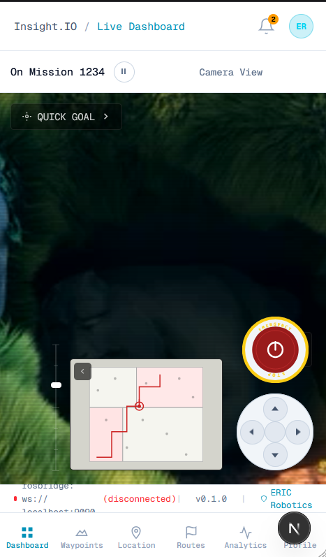

Deep Kalegaonkar
+91 7620107811
kalegaonkardeep@gmail.com

# Insight.IO — Robotics Dashboard

A real-time robotics monitoring dashboard built with **Next.js 16**, **Three.js**, and **Tailwind CSS** as part of the ERIC Robotics FSD Assignment #1.

---

## Features

| Panel | Description |
|---|---|
| **Camera Feed** | HTML5 video with scanline HUD overlay, play/pause/mute/fullscreen controls |
| **3D Map View** | Interactive point cloud renderer (Three.js + `@react-three/fiber`) — orbit controls, Z-height colour gradient, NaN-safe geometry |
| **Metrics** | Live-updating cards for Speed, Battery, Heading, Signal, Temperature, Uptime |
| **Sidebar** | Icon navigation + Settings panel (dark/light mode, display & notification toggles) |
| **Status Bar** | Live rosbridge connection dot, ping, node count, session date |
| **TopBar** | Mission status, pause/resume toggle, AUTO/MANUAL mode switch, INITIATE button — all wired to ROS2 |
| **Controls** | D-Pad (publishes `geometry_msgs/Twist` at 10 Hz while held) + Emergency Stop (latching, publishes `std_msgs/Bool`) |
| **Profile** | Operator info, robot assignment, live metrics summary, mission stats |
| **Tabs** | Waypoints · Location · Routes · Analytics — all theme-aware |

---

## Prerequisites

- **Node.js** 18 or higher (`node -v` to check)
- **npm** 9+ (comes with Node.js)

---

## Setup

### Option A — Docker (Recommended)
No Node.js installation required. Just [install Docker](https://docs.docker.com/get-docker/).

```bash
git clone https://github.com/DeepKalegaonkar/insight-io.git
cd insight-io

# Add assets first (see below), then:
docker compose up --build
```

Open **http://localhost:3000**.

> To swap the video or PCD file without rebuilding, just replace the file in `public/assets/` — the folder is mounted as a volume.

---

### Option B — Node.js (for development)

```bash
git clone https://github.com/DeepKalegaonkar/insight-io.git
cd insight-io

npm install
npm run dev   # → http://localhost:3000
```

Requires **Node.js 18+**.

---

## Adding Sample Assets

### Point Cloud (`sample.pcd`) — included in repo
`public/assets/sample.pcd` is committed and works out of the box.
To use a more detailed scan, replace it with any `.pcd` file from the
[PCL test files](https://github.com/PointCloudLibrary/pcl/tree/master/test)
(e.g. `office1.pcd` for a full room-scale scene).

### Camera Video (`sample.mp4`) — download separately
Video files are too large for git. Download any free MP4 and place it at `public/assets/sample.mp4`:
- [Pexels free videos](https://www.pexels.com/videos/) — search "driving" or "robot"
- [Big Buck Bunny](https://download.blender.org/peach/bigbuckbunny_movies/) (Creative Commons)

> **Without the video:** The camera panel shows a placeholder icon. The 3D map, metrics, controls, and all other panels are fully functional.

---

## Project Structure

```
insight-io/
├── app/
│   ├── layout.tsx               # Root layout — fonts, metadata
│   ├── page.tsx                 # Entry point (Server Component)
│   └── globals.css              # Tailwind + custom animations
├── components/
│   ├── AppShell.tsx             # Root layout shell (Sidebar + TopNav + Main + StatusBar)
│   ├── Sidebar.tsx              # Icon nav + Settings panel
│   ├── TopNav.tsx               # Breadcrumb, clock, alerts
│   ├── DashboardMain.tsx        # Camera/Map view, TopBar, D-Pad, E-Stop, all ROS controls
│   ├── MapView3D.tsx            # Three.js PCD viewer — NaN-safe, Z-height gradient
│   ├── MetricsPanel.tsx         # Live metric cards
│   ├── StatusBar.tsx            # rosbridge status, ping, version
│   └── tabs/
│       ├── WaypointsView.tsx    # Waypoint table + mission progress
│       ├── LocationView.tsx     # GPS + compass + local grid
│       ├── RoutesView.tsx       # Saved route library
│       ├── AnalyticsView.tsx    # Live sparkline charts
│       └── ProfileView.tsx      # Operator profile + live robot metrics
├── contexts/
│   └── AppContext.tsx           # Theme + active tab global state
├── hooks/
│   ├── useRobotMetrics.ts       # Simulated robot telemetry (drop-in for real ROS data)
│   └── useRosbridge.ts          # Singleton WebSocket → rosbridge (ws://localhost:9090)
└── public/
    └── assets/
        ├── sample.pcd           # Point cloud — included in repo
        └── sample.mp4           # Camera feed — download separately (see below)
```

---

## Demo

### Dashboard — 3D Map View (dark)
.png)

### Dashboard — Camera View (dark)
.png)

### Light Theme
.png)

### Profile Tab
.png)

### Mobile Layout (≤640 px)


---

## Architecture Decisions

### Why Next.js?
- App Router provides a clean Server/Client Component model — the heavy Three.js canvas loads client-only while the layout shells are pre-rendered server-side.
- Single `npm run dev` command, no separate backend needed — satisfies the self-hosted requirement.

### Why `@react-three/fiber` + Three.js?
- `@react-three/fiber` gives a declarative React API over Three.js, making the scene graph easy to maintain.
- `PCDLoader` (built into Three.js extras) handles `.pcd` files natively without a separate library.
- `@react-three/drei` provides `OrbitControls`, `Grid`, and `Text` helpers out of the box.

### Why Tailwind CSS?
- Utility classes enable rapid dark-theme layout work without separate stylesheet files.
- Responsive breakpoints (`md:`, `lg:`) are applied inline, making mobile stacking trivial.

### Why simulated metrics?
- The assignment does not specify a live ROS backend. Simulated data (`useRobotMetrics`) lets the dashboard look fully live without requiring a running ROS node.
- Plugging in real `roslibjs` data is a drop-in replacement for the hook's return values.

---

## ROS2 Integration

The dashboard connects to a real robot via **rosbridge** (no extra npm packages — uses native WebSocket).

### Start rosbridge on the robot
```bash
sudo apt install ros-$ROS_DISTRO-rosbridge-suite
ros2 launch rosbridge_server rosbridge_websocket_launch.xml
```

The status bar shows a green dot when connected. All controls publish immediately:

| Control | ROS2 Topic | Message Type |
|---|---|---|
| Pause / Resume | `/mission/pause` | `std_msgs/Bool` |
| Auto / Manual | `/robot/mode` | `std_msgs/String` |
| Initiate | `/mission/start` | `std_msgs/Bool` |
| Emergency Stop | `/emergency_stop` | `std_msgs/Bool` |
| D-Pad (hold) | `/cmd_vel` | `geometry_msgs/Twist` |

Tune `CMD_LINEAR` and `CMD_ANGULAR` in [DashboardMain.tsx](components/DashboardMain.tsx) to match your robot's velocity limits.

---

## Scripts

| Command | Description |
|---|---|
| `npm run dev` | Start development server on port 3000 |
| `npm run build` | Production build |
| `npm run start` | Serve production build |

---

## Evaluation Checklist

- [x] Faithful layout recreation — Camera feed, 3D map, PiP overlay, E-Stop, D-Pad, metrics
- [x] Camera View — video player with HUD overlays and controls
- [x] 3D Map View — point cloud renderer, orbit controls, Z-height colour gradient
- [x] Live metrics — Battery, Signal, Temperature, Speed, Uptime (simulated; drop-in for real ROS2)
- [x] Dark / Light theme — all components theme-aware
- [x] ROS2 integration — rosbridge WebSocket, all controls publish to real topics
- [x] Profile page — operator info, robot assignment, live metrics summary
- [x] Self-hosted — `npm run dev` or `docker compose up`
- [x] Docker — multi-stage build, assets volume-mounted for easy swap without rebuild
- [x] Responsive layout — sidebar hidden on mobile, bottom nav shown; TopBar collapses gracefully
- [x] Modular structure — contexts, hooks, tabs, components cleanly separated
- [x] Clean commit history

---

*Built for ERIC Robotics FSD Assignment #1*
